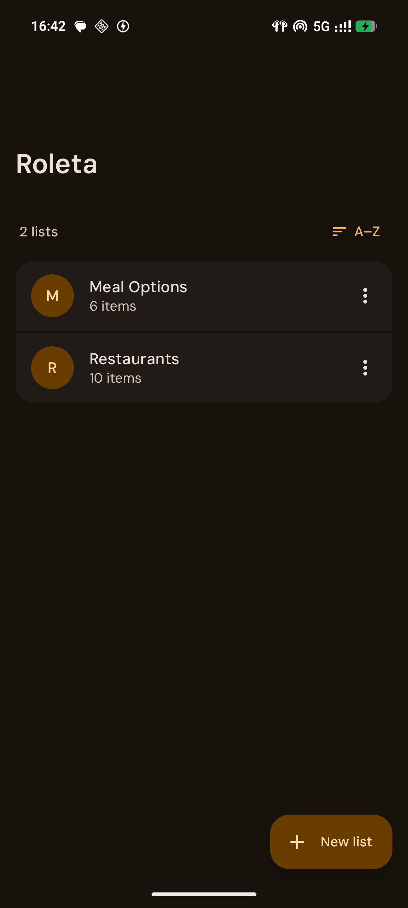
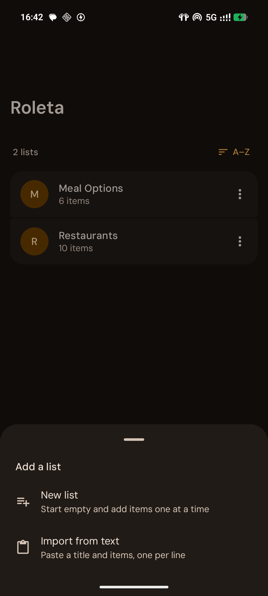
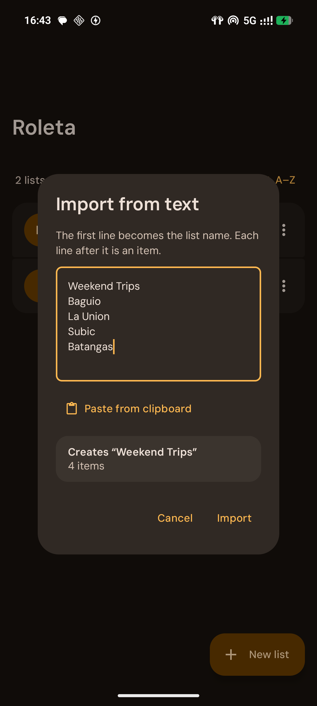
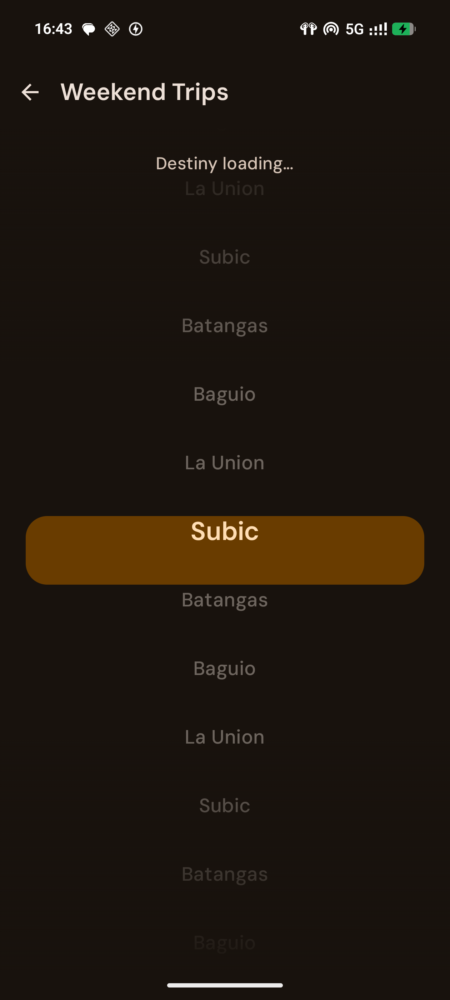
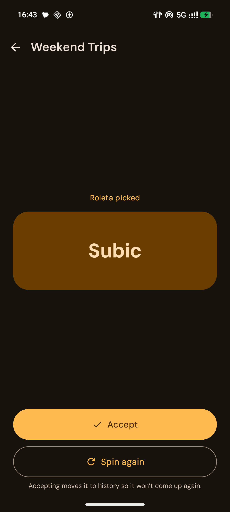

# Roleta

A mobile-first, general-purpose list randomizer. Keep named lists of anything — restaurants, movies, weekend trips — and spin a full-screen slot-machine ticker to get a random pick. Roleta eliminates decision paralysis by offloading the choice.

The name "roleta" is Filipino for roulette.

## How it works

1. Create a named list (e.g. "Restaurants", "Movies", "Weekend Trips")
2. Add items to it
3. Tap Pick — a slot-machine animation cycles through items and lands on one
4. Accept the pick (it moves to history, out of active rotation) or try again (re-spin from all active items)

Lists can also be imported in bulk from Home: **+ → Import from text**, then paste a list title on the first line and one item per line after it. If the title matches an existing list, the items are added to it. Repeated or already-present items are skipped and reported once the import finishes.

## Stack

- Kotlin, Jetpack Compose (Material 3), single activity + Compose Navigation
- Room (lists, items, pick history)
- Hilt for dependency injection
- DataStore Preferences (app settings, e.g. sort order)
- Kotlin Coroutines/Flow

Package: `com.roleta.app` · minSdk 26 · target/compile SDK 35 · Gradle 8.9 · AGP 8.5.2 · Kotlin 2.0.0

## Project structure

```
app/src/main/java/com/roleta/app/
├── data/
│   ├── datastore/     # app-level preferences (sort order, etc.)
│   ├── db/             # Room database, DAOs, entities
│   └── repository/     # RoletaRepository (single source of truth over DB), BulkImportParser
├── di/                  # Hilt modules
└── ui/
    ├── component/       # SlotMachineAnimation, EmptyState, SectionHeader, dialogs, shared composables
    ├── navigation/       # NavGraph, Routes
    ├── screen/
    │   ├── home/         # list of lists, bulk import from text
    │   ├── list/          # items within a list, spin entry point
    │   ├── pick/           # spin animation + result
    │   └── history/        # past picks
    └── theme/             # Color, Type, Shape, Theme (DM Sans font, fixed warm amber palette; no dynamic color)
```

## Build & run

**Requirements:** Android Studio (Ladybug or newer recommended), JDK 17.

1. Clone the repo and open it in Android Studio.
2. Let Gradle sync (pulls dependencies via the version catalog in `gradle/libs.versions.toml`).
3. Run on a physical device or emulator via the ▶ Run button, or from the command line:

   ```sh
   ./gradlew installDebug
   ```

### Command line

```sh
./gradlew assembleDebug   # build a debug APK
./gradlew test            # unit tests (JVM)
./gradlew connectedCheck  # instrumented tests (needs a connected device/emulator)
```

> Development so far has been done against a physical Android device connected via Android Studio — no emulator has been used/verified on the primary dev machine.

## Screenshots

| Home | Add a list | Import from text |
|---|---|---|
|  |  |  |

| Spinning | Pick result |
|---|---|
|  |  |

## Testing

- `app/src/test` — JVM unit tests (JUnit + MockK): `HomeViewModel` (incl. bulk import), `PickViewModel` (spin / try again / accept), `BulkImportParser`
- `app/src/androidTest` — instrumented tests, run on-device against an in-memory Room database: DAO tests, plus `RoletaRepositoryTest` (bulk import, accept pick, restore)

## Status

Actively developed personal project. Current focus areas and implemented features are tracked outside this repo (design notes, specs, and a running punch list); this README covers setup, not feature status.
